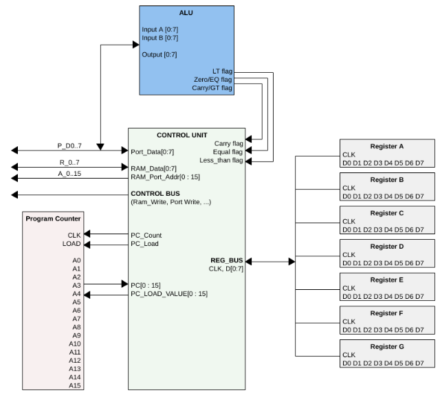

# rrisc
At Christmas 2020, I decided to hack on my [RRISC](rrisc.md) CPU. Read all about it here.

*In a hurry? See it executing a single instruction [here](firstinstr.md), a complete program [here](firstprog.md), and in physical form [here](fpgafun).*

1. [Background and why I built the RRISC CPU](why.md)
2. [Radical RISC from the early nineties](nineties.md)
3. [What's unique about the RRISC CPU](rrisc.md)
4. [It's executing its first instruction](firstinstr.md)
5. [RRISC Assembly - introduction](rriscasm.md)
6. [RRISC Assembler - writing programs](asm.md)
7. [It runs the whole test program](firstprog.md)
8. [We have an ALU!](alu.md)
9. [Playing with the ALU](aluplay.md)
10. [Open source, text-based VHDL design: vim, tmux, ghdl, gtkwave](vimghdl.md)
11. [The FPGA](fpga.md)
12. **NEW** [Becoming real: The CPU in action on an FPGA board](fpgafun.md)

---

**This is a work in progess**. More info on the minimalistic [RRISC](rrisc.md) CPU will follow as soon as I get to it. 

---

Here is a block diagram of the CPU to get you started:

---

The code is organized as follows:

- [asm](https://github.com/renerocksai/rrisc/tree/main/asm) - contains the assembler and both [simtest.asm](https://github.com/renerocksai/rrisc/blob/main/asm/simtest.asm) and [testalu.asm](https://github.com/renerocksai/rrisc/blob/main/asm/testalu.asm) which are used for first tests of the CPU
- [ghdl](https://github.com/renerocksai/rrisc/tree/main/ghdl) - contains the [-> ghdl](https://github.com/ghdl/ghdl) testbench scripts: make and run tests
- [project_2.srcs](https://github.com/renerocksai/rrisc/tree/main/ghdl) - contains the VHDL CPU and testbench sources. It's in Vivado style folders. But free [ghdl](https://github.com/ghdl/ghdl) can be used for simulations, Vivado is only required for programming your FPGA.

