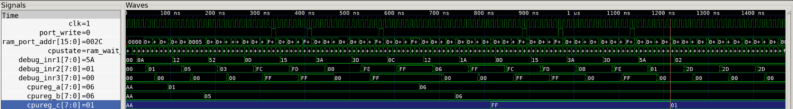
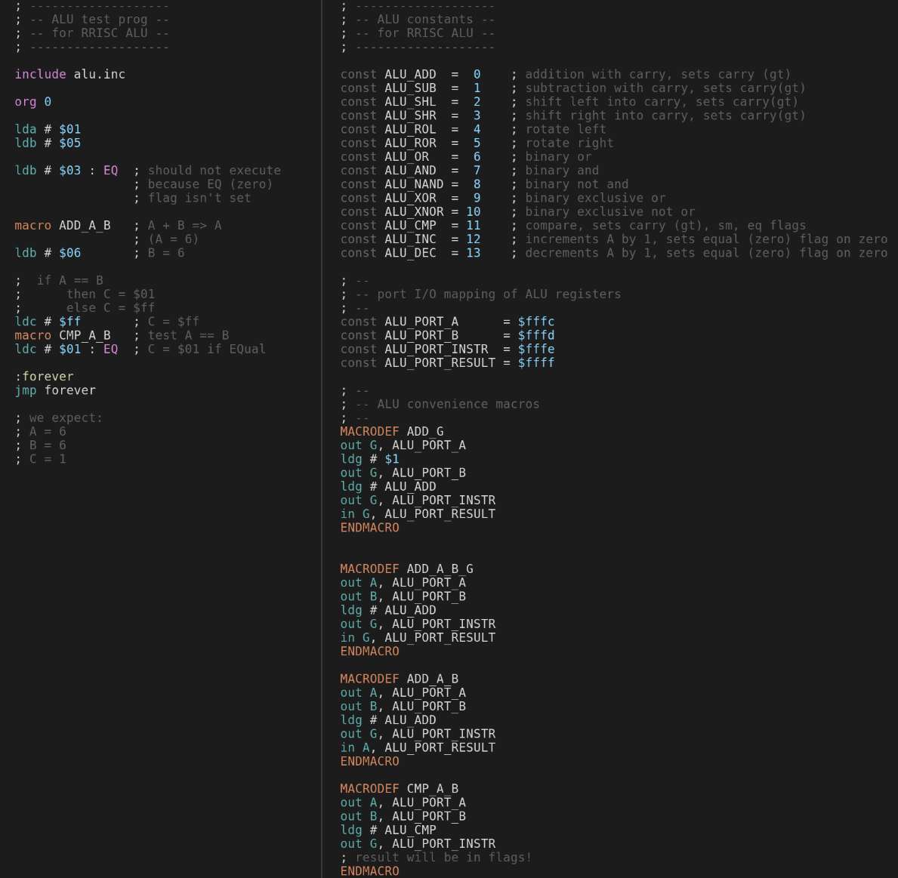

# Playing with the ALU

Now that we have an actual ALU connected to our CPU core, we can test it out. We modify our test program to do a simple add and then compare if the result is correct.

```
; -------------------
; -- ALU test prog --
; -- for RRISC ALU --
; -------------------

include alu.inc

org 0

lda # $01
ldb # $05 

ldb # $03 : EQ  ; should not execute
                ; because EQ (zero)
                ; flag isn't set

macro ADD_A_B   ; A + B => A
                ; (A = 6)
ldb # $06       ; B = 6

;  if A == B 
;      then C = $01 
;      else C = $ff
ldc # $ff       ; C = $ff
macro CMP_A_B   ; test A == B
ldc # $01 : EQ  ; C = $01 if EQual

:forever
jmp forever

; we expect:
; A = 6
; B = 6
; C = 1
```

The above code does the following:

- loads register A with value `1`
- loads register B with value `5`
- tries to load register A with value `3` if the EQ (equal/zero) flag is set
  - this instruction will not be executed if the CPU and ALU work correctly
- adds A and B, storing the resulting value `6` in register A
- loads register B with value `6`
- now both A and B contain the value `6`
- loads register C with value `$ff`
- A and B are compared
- register C is loaded with the value `$01` if the EQ flag is set
  - this will be executed since the compare operation set the EQ flag because A and B are equal
- and we loop forever

When we run the CPU core testbench with this program, we can see at the end:

- register A : `6`
- register B : `6`
- register C : `1`

It worked!

Here we can see the relevant CPU signals and registers in action:



The red vertical line is placed right after the execution phase of the `ldc # $01 : EQ` instruction. At the left you can see the values of all shown registers and signals.

And here is the complete source code, consisting of [alutest.asm](https://github.com/renerocksai/rrisc/blob/main/asm/alutest.asm) and the macros in [alu.inc](https://github.com/renerocksai/rrisc/blob/main/asm/alu.inc):



To see the actual code generated when macros are expanded, we can look at the generated `.lst` file `alutest.lst`.

Note that every line that generates code is followed by one showing the generated code, for example:

```
out G, ALU_PORT_INSTR
; > 0012: 3d fe ff
```

So the out command to the ALU instruction port (`$fffe`) is translated to the 3 bytes `$3d`, `$fe`, `$ff` - and this instruction is issued at address `$0012` in memory. 


```
; -------------------
; -- ALU test prog --
; -- for RRISC ALU --
; -------------------

; -------------------
; -- ALU constants --
; -- for RRISC ALU --
; -------------------

const ALU_ADD  =  0    ; addition with carry, sets carry (gt)
const ALU_SUB  =  1    ; subtraction with carry, sets carry(gt)
const ALU_SHL  =  2    ; shift left into carry, sets carry(gt)
const ALU_SHR  =  3    ; shift right into carry, sets carry(gt)
const ALU_ROL  =  4    ; rotate left
const ALU_ROR  =  5    ; rotate right
const ALU_OR   =  6    ; binary or
const ALU_AND  =  7    ; binary and
const ALU_NAND =  8    ; binary not and
const ALU_XOR  =  9    ; binary exclusive or
const ALU_XNOR = 10    ; binary exclusive not or
const ALU_CMP  = 11    ; compare, sets carry (gt), sm, eq flags
const ALU_INC  = 12    ; increments A by 1, sets equal (zero) flag on zero
const ALU_DEC  = 13    ; decrements A by 1, sets equal (zero) flag on zero

; --
; -- port I/O mapping of ALU registers
; --
const ALU_PORT_A      = $fffc
const ALU_PORT_B      = $fffd
const ALU_PORT_INSTR  = $fffe
const ALU_PORT_RESULT = $ffff

; --
; -- ALU convenience macros
; --


org 0

lda #$01
; > 0000: 0a 01 00

ldb #$05
; > 0003: 12 05 00


ldb #$03 : EQ  ; should not execute
; > 0006: 52 03 00

; because EQ (zero)
; flag isn't set

out A, ALU_PORT_A
; > 0009: 0d fc ff

out B, ALU_PORT_B
; > 000c: 15 fd ff

ldg # ALU_ADD
; > 000f: 3a 00 00

out G, ALU_PORT_INSTR
; > 0012: 3d fe ff

in A, ALU_PORT_RESULT
; > 0015: 0c ff ff

; (A = 6)
ldb #$06       ; B = 6
; > 0018: 12 06 00


; if A == B -> C = $01 else C = $ff
ldc #$ff       ; C = $ff
; > 001b: 1a ff 00

out A, ALU_PORT_A
; > 001e: 0d fc ff

out B, ALU_PORT_B
; > 0021: 15 fd ff

ldg # ALU_CMP
; > 0024: 3a 0b 00

out G, ALU_PORT_INSTR
; > 0027: 3d fe ff

; result will be in flags!
ldc #$01 : EQ  ; C = $01 if EQual
; > 002a: 5a 01 00


:forever
jmp forever
; > 002d: 02 2d 00


; we expect:
; A = 6
; B = 6
; C = 1

```

---

^ [toc](./)        

< [We have an ALU!](alu.md)

\> [Open source, text-based VHDL design: vim, tmux, ghdl, gtkwave](vimghdl.md)


