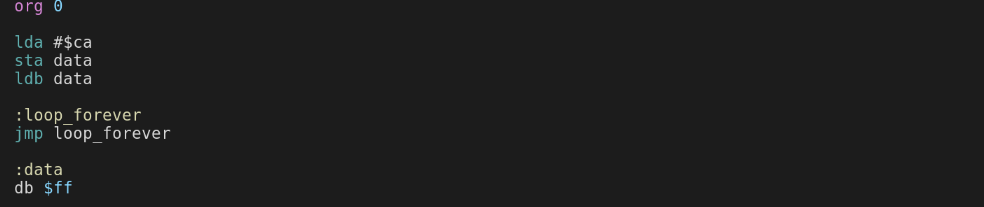
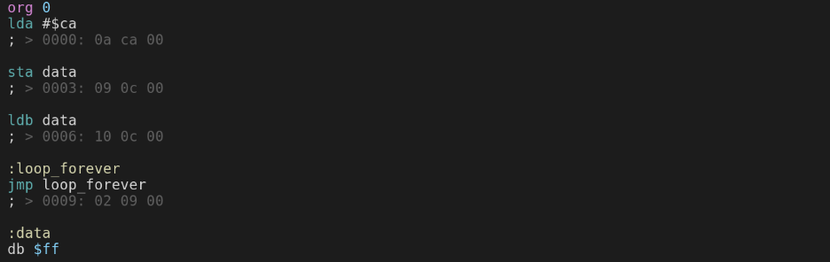
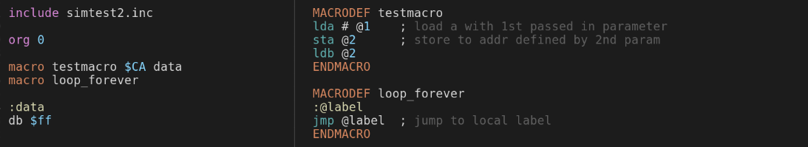
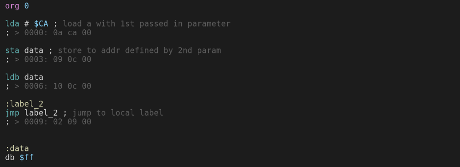

# RRISC Assembler - writing programs

To translate assembly programs into machine code you use the assemler [asm.py](https://github.com/renerocksai/rrisc/blob/main/asm/asm.py) provided in the GitHub repository.

Given source code `test.asm`, you invoke the assembler simply via:

```
python asm.py test.asm
```

The RRISC assembler is a *macro assembler*, which means it can expand macros on a textual basis, sparing you from repetetively writing nearly identical blocks of code.

# The first program

Consider the following first little program:



Here we see:
- `org 0` - defines the start address `0`
- `data` and `:data` - referencing addresses in your program
- `db $ff` - defining arbitrary byte sequences
  - Note: you can define multi-byte sequences by separating multiple bytes by whitespace: `db $00 $01 $02 $03`

The program just loads the value `$ca`, stores into RAM at address `data`, thus overwriting the value `$ff` there, reads it back into register b and then loops forever by jumping to `loop_forever`.

When you run the assembler on the above code, you get the following output:

```
$ python asm.py simtest.asm

Symbol Table:
loop_forever         : 9
data                 : 12
Generating: simtest.lst
Generating: simtest.sym
Generating: simtest.coe
Generating: simtest.bin
Generating: simtest.bit
Program size: $000d bytes.
Done!
```

It lists all symbols like `data` and `loop_forever` of your program and the values they got assigned during assembling.

Then it generates output files with the following extensions:

- `.lst` - the most interesting one, mixing your source code with generated machine code
- `.sym` - the symbol table you saw when running the program
- `.coe` - a .coe file for use in Vivado
- `.bin` - a binary file containing the machine code
- `.bit` - a text file with one byte of the machine code per line, in binary notation. Useful for integratio as `std_logic_vector` array in VHDL

The most interesting output file to look at is probably the `.lst` file:



Note how every assembly instruction is followed by a comment that shows the memory address and the machine code of the instruction.

---

# Using macros

A powerful feature of the assembler is its ability to expand parameterized text macros. Consider the following two files which produce identical machine code compared to our first test program:



Above code also illustrates that you can split your code into multiple files and then just `include` other files into your main `.asm` file. The file extension `.inc` of `simtest2.inc` is chosen arbitrarily; you do not need to follow that convention.

Here is how you define macros:

- put the code between `MACRODEF` and `ENDMACRO` lines
- parameters passed in are numbered from `@1` onwards
- local labels must begin with `@`, like `@label` or `@jump_here`, so the assembler can generate unique names for them, in case you expand the macro multiple times

To expand a macro:
- write `macro` followed by the macro name and any parameters you want to pass to the macro, separated by whitespace

As you can see in the generated `.lst` file, `@label` got expanded to `label_2`. `_2` is the postfix of the second expanded macro (the first one was `testmacro`):



---

^ [toc](./)        

< [RRISC Assembly - introduction](rriscasm.md)

\> [It runs the whole test program](firstprog.md)


