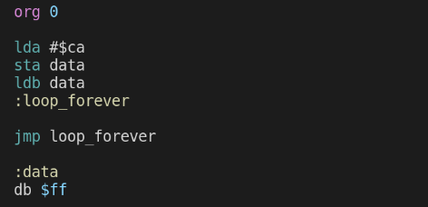

# It's executing the whole test program!!!

The test program:

What we expect after running this:
- Both registers A and B containing the value $CA
  - that means writing to and reading from RAM works
- The program counter being set to address $0009 (where the jump is) as the jump instruction is executed
  - hence, the instruction repeating itself
  - instead of the program counter incrementing past address $000B

As you can see below, both registers contain the value $CA and the program counter falling back to $0009 after reaching $000B.

The red vertical line marks the time of the first jump.

Zooming in to the first jump:

Et voila! The CPU works as expected :-)

---
^ [toc](./)        

< [RRISC Assembler - writing programs](asm.md)

\> [We have an ALU](alu.md)

