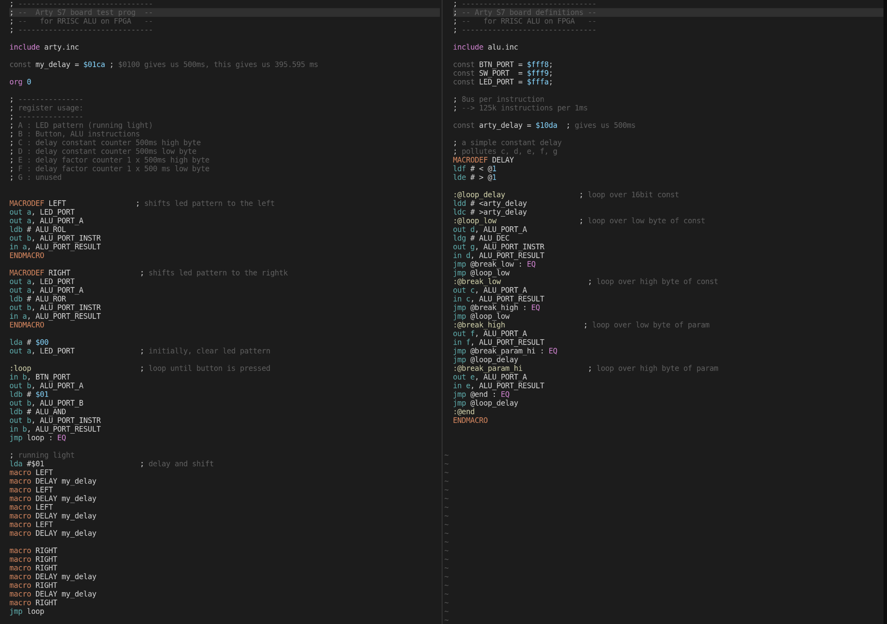

# Becoming real: The CPU in action on an FPGA board

**Note:** If you're not interested in the details, there is a [video](https://youtu.be/Ecf-VYi4tbY) at the end of the page.

All the RRISC CPU's components and the RRISC [assembler](asm.md)  have now reached a level where they can be used to write real programs and run them on real hardware, utilizing a Xilinx FPGA. 

As described in the [previous section](fpga), I use a Xilinx Spartan-7 on the Arty S7 board from Digilent. The FPGA is programmed to contain:

- The RRISC CPU core
- The RRISC ALU (arithmetic logical unit)
- 1 kB of RAM for testing, initialized with an example program
- 3 ports connected to the Arty board peripherals:
  - 4 LEDs
  - 4 switches
  - 4 buttons

The CPU is clocked with 100 MHz, giving us 80 ns per instruction cycle. As a quick [recap](firstinstr.md), a single instruction is executed in the following phases, taking 10 nanoseconds each:

- `ram_wait_1`
- `fetch_1`
- `ram_wait_2`
- `fetch_2`
- `ram_wait_3`
- `fetch_3`
- `decode`
- `execute`

---

## The example program

The example program is a simple LED running light demo, activated by pressing the button. Once the button is pressed, the light runs from right to left and then back to right, where it remains until the button is pressed again.

The running light pattern is achieved with simple bit shifting, executed by the [ALU](alu.md) using its `ROL` (rotate left) and `ROR` (rotate right) operations.

Here is the code consisting of the main assembly file [runninglight.asm](https://github.com/renerocksai/rrisc/blob/main/asm/arty_runninglight.asm) and an include file [arty.inc](https://github.com/renerocksai/rrisc/blob/main/asm/arty.inc) containing macro definitions for the Arty board and timing constants:

A simulation run shows (in the 1st line), that the LEDs are activated in the correct pattern:

So, let's see it in action!

---

## Example running on real hardware

  <iframe
      src="https://youtube.com/embed/Ecf-VYi4tbY"
      width="100%"
      height="480"
      frameborder="0"
      allowfullscreen="">
  </iframe>

---

^ [toc](./)        

< [The FPGA](fpga.md)

